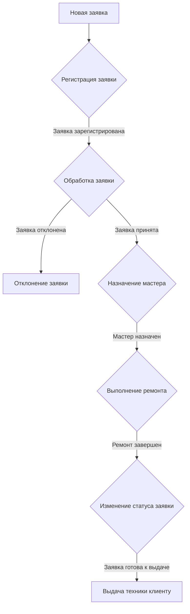
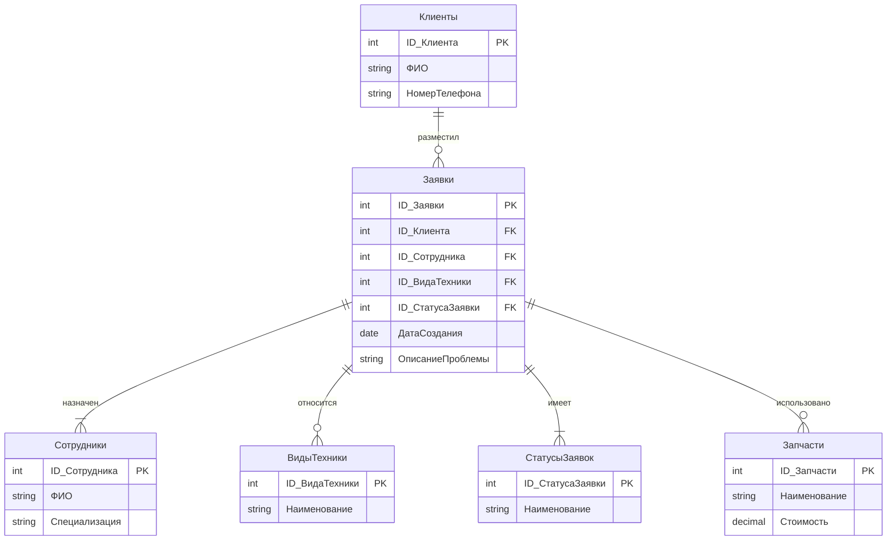

## Спецификация модуля

**Название:** Модуль учета заявок на ремонт бытовой техники

**Версия:** 1.0

**Дата:** 2024-06-07

**Описание:** 

Данный модуль предназначен для автоматизации учета заявок на ремонт бытовой техники в сервисных центрах. Он позволяет регистрировать новые заявки, отслеживать их статус, назначать ответственных за выполнение работ, а также формировать отчеты о проделанной работе.

**Входные данные:**

* Информация о заявке:
    * Вид бытовой техники
    * Модель бытовой техники
    * Описание проблемы
    * ФИО клиента
    * Номер телефона
* Информация о мастере:
    * ФИО мастера
    * Специализация
* Информация о статусе заявки:
    * Новая
    * В процессе ремонта
    * Готова к выдаче
    * Ожидание запчастей

**Выходные данные:**

* Список заявок с возможностью фильтрации и сортировки
* Детальная информация о заявке
* Отчеты:
    * Количество выполненных заявок
    * Среднее время выполнения заявки
    * Статистика по типам неисправностей

## Алгоритм учета заявок на ремонт бытовой техники

```mermaid
graph TD
    A[Новая заявка] --> B(Регистрация заявки)
    B --> C{Назначен ли мастер?}
    C -- Да --> D(Назначение на ремонт)
    C -- Нет --> E[Ожидание назначения]
    D --> F(Выполнение ремонта)
    F --> G{Ремонт выполнен?}
    G -- Да --> H(Изменение статуса на "Готов к выдаче")
    G -- Нет --> I[Продолжение ремонта]
    H --> J(Выдача техники клиенту)
    E --> D
    J --> K(Расчет статистики)
```

## Алгоритм расчета количества заявок

```
1. Инициализировать переменную "количество заявок" значением 0.
2. Для каждой заявки в системе:
    - Увеличить значение переменной "количество заявок" на 1.
3. Вернуть значение переменной "количество заявок".
```

## Интерфейс

Интерфейс модуля будет состоять из следующих основных форм:

* **Форма списка заявок:** отображает список всех заявок с возможностью фильтрации, сортировки и поиска.
* **Форма добавления/редактирования заявки:** позволяет добавлять новые заявки и редактировать существующие.
* **Форма просмотра заявки:** отображает детальную информацию о заявке.
* **Форма назначения ответственного:** позволяет назначить ответственного за выполнение работ по заявке.
* **Форма просмотра отчетов:** отображает отчеты о проделанной работе.

## Обработка исключительных ситуаций

Модуль будет обрабатывать следующие исключительные ситуации:

* Некорректный ввод данных пользователем
* Ошибки при работе с базой данных
* Отсутствие подключения к сети

## Отладка

Отладка модуля будет проводиться с использованием отладчика, встроенного в среду разработки. В процессе отладки будут проверяться:

* Корректность работы алгоритмов
* Обработка исключительных ситуаций
* Производительность модуля

## Тестирование

Функциональное тестирование модуля будет проводиться по следующим сценариям:

* **Добавление новой заявки**
* **Редактирование существующей заявки**
* **Назначение ответственного за выполнение работ**
* **Изменение статуса заявки**
* **Формирование отчетов**

Для тестирования будут использоваться реальные данные, предоставленные заказчиком.

## Результаты тестирования

Результаты тестирования будут оформлены в виде протокола, который будет содержать следующую информацию:

* Дата и время проведения тестирования
* Версия тестируемого модуля
* Список протестированных функций
* Результаты тестирования каждой функции
* Выявленные ошибки и замечания

## Пример реализации кода (Python)

```python
class Application:
    def __init__(self):
        self.requests = []

    def add_request(self, request):
        """
        Добавляет заявку в систему.
        """
        self.requests.append(request)

    def get_requests(self):
        """
        Возвращает список заявок.
        """
        return self.requests

    def get_request_by_id(self, request_id):
        """
        Возвращает заявку по ID.
        """
        for request in self.requests:
            if request.id == request_id:
                return request
        return None

    def calculate_requests_count(self):
        """
        Рассчитывает количество заявок.
        """
        return len(self.requests)
```

## База данных

Для хранения данных модуля будет использоваться реляционная база данных. Структура базы данных будет включать в себя следующие таблицы:

* **Заявки:** хранит информацию о заявках на ремонт.
* **Клиенты:** хранит информацию о клиентах.
* **Мастера:** хранит информацию о мастерах.
* **Статусы заявок:** хранит список возможных статусов заявок.

## Безопасность

Для обеспечения безопасности доступа к данным модуля будут использоваться следующие меры:

* Аутентификация пользователей по логину и паролю.
* Разграничение прав доступа пользователей к функциям и данным модуля.

## Документация

По завершении разработки модуля будет подготовлена следующая документация:

* **Техническое задание**
* **Руководство пользователя**

## Дальнейшее развитие

В дальнейшем планируется реализовать следующие возможности:

* Интеграция с другими системами учета.
* Мобильное приложение для клиентов и мастеров.
* Автоматическое назначение ответственных за выполнение работ.
* Анализ данных и формирование прогнозов.
```


## Модуль 1: Разработка модулей программного обеспечения для компьютерных систем

### Спецификация модуля

**Название:** Модуль учета заявок на ремонт бытовой техники

**Версия:** 1.0

**Описание:** 
Данный модуль предназначен для автоматизации процесса учета заявок на ремонт бытовой техники в сервисных центрах.

**Входные данные:**

* **Информация о заявке:**
    * Номер заявки
    * Дата добавления
    * Вид бытовой техники
    * Модель бытовой техники
    * Описание проблемы
    * ФИО клиента
    * Номер телефона
    * Статус заявки (новая, в процессе ремонта, готова к выдаче)
* **Информация о мастере:**
    * ФИО мастера
    * Специализация
* **Информация о запчастях:**
    * Наименование запчасти
    * Стоимость

**Выходные данные:**

* **Список заявок с возможностью фильтрации и сортировки**
* **Детальная информация о заявке:**
    * Информация о клиенте
    * Описание проблемы
    * История изменений статуса заявки
    * Назначенный мастер
    * Список использованных запчастей
* **Отчеты:**
    * Количество выполненных заявок за период
    * Среднее время выполнения заявки
    * Статистика по типам неисправностей

### Алгоритм учета заявок



### Алгоритм расчета количества заявок

```
// Функция принимает дату начала и дату окончания периода
Функция ПолучитьКоличествоЗаявокЗаПериод(ДатаНачала, ДатаОкончания)

    // Инициализируем переменную для хранения количества заявок
    КоличествоЗаявок = 0;

    // Получаем список всех заявок из базы данных
    СписокЗаявок = ПолучитьСписокЗаявок();

    // Проходим по списку заявок
    Для Каждого Заявка Из СписокЗаявок Цикл

        // Если дата создания заявки попадает в заданный период
        Если Заявка.ДатаСоздания >= ДатаНачала И Заявка.ДатаСоздания <= ДатаОкончания Тогда

            // Увеличиваем количество заявок на 1
            КоличествоЗаявок = КоличествоЗаявок + 1;

        КонецЕсли;

    КонецЦикла;

    // Возвращаем количество заявок
    Возврат КоличествоЗаявок;

КонецФункции
```

### Разработка интерфейса

**Главное окно:**

* Список заявок (таблица с возможностью фильтрации и сортировки)
* Кнопки: "Добавить заявку", "Редактировать заявку", "Удалить заявку", "Поиск заявки", "Отчеты"

**Окно добавления/редактирования заявки:**

* Поля для ввода информации о заявке (Номер, Дата, Вид техники, Модель, Описание проблемы, ФИО клиента, Номер телефона, Статус)
* Выпадающий список для выбора мастера
* Кнопки: "Сохранить", "Отмена"

**Окно отчетов:**

* Выбор типа отчета
* Задание параметров отчета
* Кнопка "Сформировать отчет"

### Реализация алгоритма

Реализация алгоритма будет выполнена на языке программирования 1С с использованием встроенных механизмов платформы.

### Отладка и тестирование

Отладка модуля будет выполнена с использованием встроенного отладчика платформы 1С.

**Пример теста:**

**Тест функции ПолучитьКоличествоЗаявокЗаПериод()**

* **Входные данные:** 
    * ДатаНачала = 01.01.2024
    * ДатаОкончания = 31.01.2024
* **Ожидаемый результат:** 
    * Количество заявок = 10 (например)

## Модуль 2: Разработка, администрирование и защита баз данных

### ER-диаграмма



### Создание базы данных

База данных будет создана на платформе PostgreSQL.

**Создание таблиц:**

```sql
-- Таблица "Клиенты"
CREATE TABLE Клиенты (
    ID_Клиента SERIAL PRIMARY KEY,
    ФИО VARCHAR(255) NOT NULL,
    НомерТелефона VARCHAR(20)
);

-- Таблица "Сотрудники"
CREATE TABLE Сотрудники (
    ID_Сотрудника SERIAL PRIMARY KEY,
    ФИО VARCHAR(255) NOT NULL,
    Специализация VARCHAR(255)
);

-- Таблица "ВидыТехники"
CREATE TABLE ВидыТехники (
    ID_ВидаТехники SERIAL PRIMARY KEY,
    Наименование VARCHAR(255) UNIQUE NOT NULL
);

-- Таблица "СтатусыЗаявок"
CREATE TABLE СтатусыЗаявок (
    ID_СтатусаЗаявки SERIAL PRIMARY KEY,
    Наименование VARCHAR(255) UNIQUE NOT NULL
);

-- Таблица "Запчасти"
CREATE TABLE Запчасти (
    ID_Запчасти SERIAL PRIMARY KEY,
    Наименование VARCHAR(255) UNIQUE NOT NULL,
    Стоимость DECIMAL(10, 2)
);

-- Таблица "Заявки"
CREATE TABLE Заявки (
    ID_Заявки SERIAL PRIMARY KEY,
    ID_Клиента INT NOT NULL,
    ID_Сотрудника INT,
    ID_ВидаТехники INT NOT NULL,
    ID_СтатусаЗаявки INT NOT NULL,
    ДатаСоздания DATE NOT NULL,
    ОписаниеПроблемы TEXT,
    FOREIGN KEY (ID_Клиента) REFERENCES Клиенты(ID_Клиента),
    FOREIGN KEY (ID_Сотрудника) REFERENCES Сотрудники(ID_Сотрудника),
    FOREIGN KEY (ID_ВидаТехники) REFERENCES ВидыТехники(ID_ВидаТехники),
    FOREIGN KEY (ID_СтатусаЗаявки) REFERENCES СтатусыЗаявок(ID_СтатусаЗаявки)
);

```

### Заполнение базы данных

Данные из предоставленных файлов будут импортированы в соответствующие таблицы базы данных.

### Создание запросов и отчетов

**Пример запроса:**

Получить список заявок с информацией о клиенте, виде техники, статусе заявки и назначенном мастере:

```sql
SELECT 
    z.ID_Заявки,
    z.ДатаСоздания,
    k.ФИО AS ФИОКлиента,
    k.НомерТелефона,
    vt.Наименование AS ВидТехники,
    sz.Наименование AS СтатусЗаявки,
    s.ФИО AS ФИОМастера
FROM 
    Заявки z
JOIN 
    Клиенты k ON z.ID_Клиента = k.ID_Клиента
JOIN 
    ВидыТехники vt ON z.ID_ВидаТехники = vt.ID_ВидаТехники
JOIN 
    СтатусыЗаявок sz ON z.ID_СтатусаЗаявки = sz.ID_СтатусаЗаявки
LEFT JOIN 
    Сотрудники s ON z.ID_Сотрудника = s.ID_Сотрудника;
```

### Резервное копирование

Резервное копирование базы данных будет настроено с использованием инструмента pg_dump.

### Регистрация пользователей и уровни доступа

**Принцип регистрации:** 
Ролевая модель.

**Группы пользователей:**

* Администратор
* Менеджер
* Мастер

**Уровни доступа:**

| Действие | Администратор | Менеджер | Мастер |
|---|---|---|---|
| Просмотр заявок | + | + | + |
| Добавление заявок | + | + | - |
| Редактирование заявок | + | + | + |
| Удаление заявок | + | - | - |
| Назначение мастера | + | + | - |
| Изменение статуса заявки | + | + | + |
| Просмотр отчетов | + | + | - |

Реализация уровней доступа будет выполнена с использованием механизмов безопасности PostgreSQL.
romansh958@gmail.com
